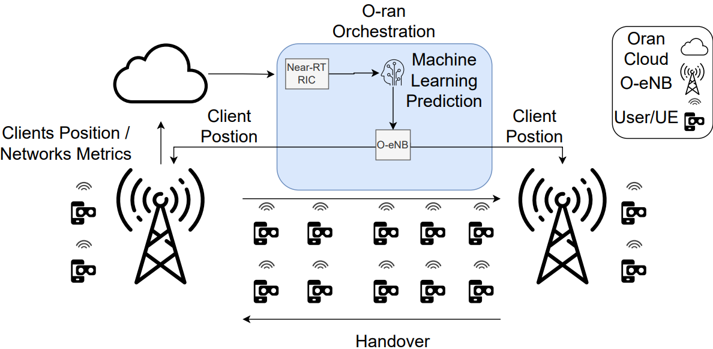

# Enhancing the Handover Algorithm with an Intelligent Approach in the O-RAN Architecture

# Authors
- Kleber Vilhena,
- Carlos Rocha,
- Rafael Veiga,
- Lucas Bastos,
- Eduardo Cerqueira,
- Denis Rosário

# Abstract

O-RAN is an architecture that promotes interoperability and openness in 5G Radio Access Networks (RAN) using scheduling, disaggregation, and virtualization. RICs (RAN Intelligence Controllers) offer solutions such as Machine Learning (ML), traffic steering, anomaly detection, and QoS (Quality of Service) support. Novel intelligent handover strategies are critical to the success of 5G or even 6G O-RAN-based networks. This paper proposes and evaluates an intelligent handover algorithm for O-RAN environments. It leverages an LTE testbed featuring O-RAN architecture to assess downlink and uplink performance across various User Equipment (UE) scenarios. The proposed scheme was implemented and tested using ns-O-RAN, an O-RAN system integrated with the NS-3 simulator. Our simulator results demonstrate a throughput and delay enhancement compared to traditional handover methods across various scenarios involving 50 to 100 UEs.  

# Big picture



## Run Example

Clone the project:

~~~bash  
git clone https://github.com/KleberVilhena/LTE-NS3
~~~

## Install dependencies
~~~bash
pip3 install --user sem pandas numpy scikit-learn
~~~

## Install PyTorch
PyTorch is widely available through most linux distribution package bases.
Therefore, a user should simply be able to install the desired
"python-pytorch" package with no further steps being required. However, if
the user cannot or does not wish to install the package, one simply can
download the PyTorch libraries that are distrubited on the PyTorch webiste
([https://pytorch.org/](https://pytorch.org/)), and export the location of the
extracted library to the `LIBTORCHPATH` environment variable. For example,

```shell
# Change to home directory
cd ~

# Download the library files
wget "https://download.pytorch.org/libtorch/cpu/libtorch-cxx11-abi-shared-with-deps-2.2.2%2Bcpu.zip"

# Extract the library files
unzip libtorch-cxx11-abi-shared-with-deps-2.2.2+cpu.zip

# Create environment variable with library location so that cmake knows where
# to find it
export LIBTORCHPATH="/home/$(whoami)/libtorch"

```
At this point, the accessibility of the library can be verified by navigating
to the working directory of `ns-3` and running the following command.

```shell
./ns3 configure
```

The output of this command should include the text "find_external_library:
Torch was found," indicating that the library and necessary source
files were discovered.

## Generate initial position trace (Optional)
Generate a trace containing the initial positions of users spawned in the
training simulation. There are two options of scripts to run, the first
generates positions inside a rectangle whose dimentions can be changed by
editing the script:
~~~bash  
python3 generate-positioning-data.py
~~~

The second generates positions inside a circle whose radius can be changed
by editing the script:

~~~bash  
python3 generate-disc-positioning-data.py
~~~
## Setup ramdisk (Recommended)
Create a ZRAM ramdisk to avoid I/O bottleneck while generating the dataset. The
script will ask for the user password to acquire root privileges using sudo.
~~~bash  
./setup-ram.sh
~~~
## Generate training dataset
~~~bash  
python3 ./generate-training-data.py
~~~
## Train model
~~~bash
python3 ./oran-ml-handover-classifier.py
~~~
## Run simulations
This script uses the simulation execution manager to compile ns3 and run 
multiple simulations in parallel. The simulation results are stored as
directory tree in the results subdirectory.
~~~bash
python3 ./run-simulations.py
~~~
## Plot results (Optional)
The subdirectory *graficos* contains scripts that parse and plot the files generated
by the simulations.
~~~bash
cd graficos
python3 qos-vs-users.py
~~~
